# A Comparative Performance Analysis of High-Performance Linux IPC Mechanisms: POSIX Pipes, UNIX Domain Sockets, POSIX Message Queues, and `io_uring` Shared Memory Rings

---

## Abstract
Modern system design increasingly shifts toward decoupled, microservices-based, and multi-process architectures, heightening the reliance on Inter-Process Communication (IPC) throughput and latency. Traditionally, IPC mechanisms like POSIX Pipes, UNIX Domain Sockets, and POSIX Message Queues have mediated data transfers through the Linux kernel, incurring system-call transitions, context-switching latency, and memory copies. This paper presents a comparative empirical evaluation of traditional kernel-mediated IPC mechanisms against a lock-free, cache-aligned Shared Memory Ring buffer assisted by Linux's asynchronous I/O framework (`io_uring`). We evaluate the performance metrics across a workload size sweep (64 Bytes to 1 MiB) with hardware CPU core affinity pinning. Our findings show that the `io_uring` shared-memory mechanism achieves up to a $10\times$ throughput speedup and reduces median latency by several orders of magnitude under medium message sizes by bypassing user-kernel transitions and avoiding cache-line false sharing.

---

## I. Introduction
Inter-Process Communication is the bedrock of concurrent system design on Unix-like operating systems. High-performance computing, financial trading systems, and containerized microservices require message buses capable of transferring gigabytes of telemetry or transactional data per second with sub-microsecond latency.

Traditional IPC options rely on kernel-mediated buffer boundaries. While providing clean process separation and safety, they enforce system call overhead (e.g., `read`, `write`, `sendmsg`, `recvmsg`) and physical memory copies between userspace processes and kernel ring structures. To address these overheads, memory-mapped shared regions have been utilized for zero-copy transfers, but coordinating access to these regions usually requires synchronization primitives like mutexes or semaphores, which can default to kernel-space blocking under lock contention.

This paper evaluates a lock-free, Single-Producer Single-Consumer (SPSC) ring buffer architecture mapped into shared memory. The architecture utilizes atomic memory operations to coordinate boundaries without system calls, and leverages Linux's `io_uring` kernel polling (`SQPOLL`) for asynchronous out-of-band coordination. We benchmark this mechanism against three ubiquitous kernel-mediated baselines under a strict, hardware-pinned testing methodology.

---

## II. System Architecture & IPC Topologies

The evaluation focuses on four distinct IPC paradigms, each implemented in C++17 with direct OS syscall calls:

```mermaid
graph TD
    subgraph POSIX Pipe
        P1[Producer Core 1] -->|write| K_FIFO[Kernel FIFO Buffer]
        K_FIFO -->|read| C1[Consumer Core 2]
    end
    subgraph UNIX Socket
        P2[Producer Core 1] -->|sendmsg| K_SKB[Kernel Socket Buffer]
        K_SKB -->|recvmsg| C2[Consumer Core 2]
    end
    subgraph POSIX MQ
        P3[Producer Core 1] -->|mq_send| K_MQ[Kernel Mqueue Inode]
        K_MQ -->|mq_receive| C3[Consumer Core 2]
    end
    subgraph io_uring Shared Ring
        P4[Producer Core 1] -->|mmap Release| SHM_RING[Mmapped Shared Ring]
        C4[Consumer Core 2] -->|mmap Acquire| SHM_RING
        SHM_RING -.->|SQPOLL| K_SQ[SQPOLL Kernel Thread Core 3]
    end
```



### A. POSIX Named Pipes (FIFO)
POSIX pipes represent a uni-directional, kernel-buffered byte stream. They rely on standard file descriptors where synchronization is handled implicitly by the kernel scheduler:
- **Write Path**: Invokes the `write` system call, blocking the producer if the pipe buffer capacity is reached.
- **Read Path**: Invokes the `read` system call, blocking the consumer when no data is available.
- **Tuning**: The pipe buffer capacity is dynamically increased to the maximum payload size (1 MiB) via `fcntl(fd, F_SETPIPE_SZ)` to minimize backpressure blocking.

### B. UNIX Domain Sockets (`AF_UNIX`)
Unix Domain Sockets provide bi-directional stream-oriented communication. Unlike network sockets, they bypass the network stack but still utilize the socket layer:
- **Connection Model**: Client-server topology using `SOCK_STREAM`.
- **System Call Path**: Relies on `send` and `recv` interfaces.
- **Tuning**: Socket transmit and receive buffers are tuned to 2 MiB via `setsockopt(..., SO_SNDBUF/SO_RCVBUF)` to support continuous high-rate streaming.

### C. POSIX Message Queues (`mqueue`)
POSIX message queues are message-oriented, allowing structured, priority-based delivery:
- **API**: Relies on `mq_send` and `mq_receive`.
- **Limits**: Constrained by kernel sysctl limits (`fs.mqueue.msg_max` and `fs.mqueue.msgsize_max`). Message limits are set to 10 entries with payload sizing matching the dynamic sweep scale.
- **Filesystem Node**: Message queues are tracked inside the virtual VFS tree under `/dev/mqueue`, introducing inode lock evaluation paths in the kernel.

### D. `io_uring` + Shared Memory SPSC Ring
The high-performance transport maps a cache-aligned `RingBuffer` struct into POSIX shared memory (`shm_open` and `mmap`):
- **Lock-Free Atomics & Sequential Consistency**: Synchronization uses atomic indices `head` and `tail` along with the `consumer_sleeping` coordinator flag. The critical updates and checks use Sequential Consistency memory barriers (`std::memory_order_seq_cst`) to guarantee correct instruction ordering and prevent Store-Load CPU reordering deadlocks.
- **False-Sharing Avoidance**: The `head` and `tail` pointers are isolated on separate cache lines using `alignas(64)` boundaries, preventing cache-line invalidation loops (ping-ponging) between producer and consumer cores.
- **Dual-Ended Asynchronous Wakeup Signaling**: Coordinates sleep and wakeup events via a named FIFO (`/tmp/uring_sig_fifo`) and an atomic `consumer_sleeping` flag. The consumer blocks using `io_uring_submit_and_wait` to read from the signaling FIFO, and the producer wakes it up by submitting write tasks via `io_uring_prep_write`, making the out-of-band signaling path entirely asynchronous and handled via `io_uring` on both ends.

---

## III. Experimental Methodology

To isolate IPC overhead from OS scheduling jitter and hardware cache anomalies, we enforce the following experimental controls:

### A. Message Size Sweep Matrix
Benchmarks are executed across an exponential sweep of payload sizes $S \in \{64\text{ B}, 256\text{ B}, 1024\text{ B}, 4\text{ KiB}, 16\text{ KiB}, 64\text{ KiB}, 256\text{ KiB}, 1\text{ MiB}\}$.

### B. CPU Affinity Pinning
Processor affinity is pinned statically using `sched_setaffinity` to isolate tasks onto physical CPU cores, preventing core-hopping and optimizing cache usage:
- **Producer Core**: Pinned to CPU Core 1.
- **Consumer Core**: Pinned to CPU Core 2.

### C. Analytical Metrics
For each message size class, the benchmark executes 1 warmup run (discarded) and $N = 15$ measured runs for statistics stabilization across all IPC mechanisms. The following equations define the metrics:
1. **Throughput ($T$)**: The volume of data transferred per unit time:
   $$T = \frac{B}{1024^3 \times t_{\text{exec}}} \quad (\text{GiB/s})$$
   where $B$ is the total volume target in bytes, and $t_{\text{exec}}$ is the elapsed execution wall-clock time in seconds.
2. **End-to-End Latency ($L_i$)**: The time taken for message $i$ to traverse the IPC channel:
   $$L_i = t_{\text{recv}, i} - t_{\text{send}, i} \quad (\mu\text{s})$$
   where $t_{\text{send}, i}$ is stamped by the producer immediately before write/publish, and $t_{\text{recv}, i}$ is stamped by the consumer immediately after read/retrieve.
3. **Latency Standard Deviation ($\sigma$)**:
   $$\sigma = \sqrt{\frac{1}{M}\sum_{i=1}^M (L_i - \bar{L})^2}$$
   where $M$ is the number of latency samples and $\bar{L}$ is the arithmetic mean.

### D. Workload Target Sizing
To prevent brief runs from introducing clock resolution errors, target volumes scale based on the payload size classes and the specific IPC mechanism under test:
- **POSIX Pipes & POSIX Message Queues (Dynamic Sizing)**:
  - Small Payloads ($\le 1$ KiB): $32$ MiB total transfer.
  - Medium Payloads ($\le 64$ KiB): $256$ MiB total transfer.
  - Large Payloads ($> 64$ KiB): $2$ GiB total transfer.
- **UNIX Domain Sockets & `io_uring` Shared Ring (Static Sizing)**:
  - All Payload Sizes ($64$ Bytes to $1$ MiB): $2$ GiB total transfer.

### E. Checksum Verification
To prevent compilers from optimizing out the memory access path, the consumer performs a strided cache-line payload touch:
$$\text{Checksum} = \sum_{k=0}^{S/64} \text{Payload}[64 \times k]$$
This forces physical L1/L2 data cache fills, mimicking a real application reading incoming message payloads.

### F. Reference Test Environment
All benchmark runs and profiling tasks were executed on a dedicated test machine with the following physical and operating system specifications:
- **System Model**: ASUS Vivobook K3605ZF (Vivobook_ASUSLaptop K3605ZF_K3605ZF)
- **Operating System**: Ubuntu 24.04.4 LTS (noble)
- **CPU Architecture**: `x86_64`
- **Processor**: 12th Gen Intel(R) Core(TM) i5-12500H
  - **Thread/Core Layout**: 12 Physical Cores (16 Threads, 1 Socket)
  - **Frequency**: Max 4500.00 MHz / Min 400.00 MHz
  - **Caches**: L1d 448 KiB (12 instances), L1i 640 KiB (12 instances), L2 9 MiB (6 instances), L3 18 MiB (1 instance)
- **System Memory**: 16 GiB System Memory (2x 8GiB SODIMM DDR4 Synchronous 3200 MHz)
- **Virtual Memory**: 4.0 GiB Swap
- **Storage**: 512GB NVMe SSD (SAMSUNG MZVL4512HBLU-00BTW)
- **Graphics Processors**:
  - Integrated: Intel Corporation Alder Lake-P GT2 [Iris Xe Graphics]
  - Dedicated: NVIDIA Corporation GA107M [GeForce RTX 2050]

---

### IV. Repository Structure

```
.
├── src/                          # Source code folders for the IPC benchmark targets
│   ├── pipe/                     # POSIX Named Pipes benchmark directory
│   │   ├── common.h              # Message structures and configuration
│   │   ├── pipe_producer.cpp     # Producer C++ application
│   │   ├── pipe_consumer.cpp     # Consumer C++ application & stats
│   │   └── run_pipe_bench.sh     # Script to compile and run pipe benchmark
│   │
│   ├── sockets/                  # UNIX Domain Sockets benchmark directory
│   │   ├── common.h              # Common structures and socket endpoints
│   │   ├── socket_producer.cpp   # Client socket producer C++ application
│   │   ├── socket_consumer.cpp   # Server socket consumer & statistics
│   │   └── run_socket_bench.sh     # Script to compile and run socket benchmark
│   │
│   ├── mq/                       # POSIX Message Queue benchmark directory
│   │   ├── common.h              # Common structures and MQ configuration
│   │   ├── mq_producer.cpp       # POSIX mq_send producer C++ application
│   │   ├── mq_consumer.cpp       # POSIX mq_receive consumer & statistics
│   │   └── run_mq_bench.sh       # Script to compile and run message queue benchmark
│   │
│   └── io_uring/                 # io_uring + Shared-Ring benchmark directory
│       ├── common.h              # Cache-aligned atomic RingBuffer layout
│       ├── uring_producer.cpp    # liburing-driven producer C++ application
│       ├── uring_consumer.cpp    # Shared-memory consumer C++ application & stats
│       └── run_uring_bench.sh    # Script to compile and run io_uring benchmark
│
├── data/                         # CSV results datasets and performance log data
│   ├── pipe_results.csv
│   ├── socket_results.csv
│   ├── mq_results.csv
│   ├── io_uring_results.csv
│   └── Cache Misses              # Hardware performance counter logs
│
├── scripts/                      # Visualization and statistical scripts
│   ├── generate_visualizations.py# Process CSV data and generate plots
│   └── statistical_analysis.py   # Run 95% Confidence Interval validation reports
│
├── figures/                      # Directory for generated publication assets
│   ├── throughput.png            # Throughput comparison chart (GB/s)
│   ├── latency.png               # Latency comparison chart (microseconds, Log Scale)
│   ├── speedup.png               # io_uring Speedup comparison chart
│   ├── cache_misses.png          # Cache miss rates comparison chart
│   ├── cache_misses_summary.csv  # Cache miss CSV counts
│   ├── throughput_ci.png         # Throughput mean with 95% CI error bars
│   ├── latency_ci.png            # Latency mean with 95% CI error bars
│   ├── statistical_analysis.md   # Statistical validation report
│   └── flamegraphs/              # Interactive flamegraph gallery
│       ├── index.html            # Gallery page
│       ├── pipe_flamegraph.svg
│       ├── socket_flamegraph.svg
│       ├── mq_flamegraph.svg
│       └── final_io_uring.jpg
│
└── ipc_implementation_documentation.md # Detailed cross-implementation narrative
```

---

## V. Execution and Reproducibility

### A. System Configuration Check
Ensure compile tools, shared library symbols, and runtime packages are installed:
```bash
# Ubuntu/Debian dependencies
sudo apt-get update
sudo apt-get install -y build-essential liburing-dev python3-matplotlib python3-scipy perf-tools-unstable
```

### B. Benchmark Execution
Compile and run the benchmarks sequentially from their folders, and copy their output CSV files to the `data/` directory for visualization processing:

```bash
# 1. Run POSIX Pipe Benchmark
cd src/pipe && bash run_pipe_bench.sh && cp -f pipe_results.csv ../../data/ && cd ../..

# 2. Run UNIX Domain Sockets Benchmark
cd src/sockets && bash run_socket_bench.sh && cp -f socket_results.csv ../../data/ && cd ../..

# 3. Run POSIX Message Queue Benchmark
cd src/mq && bash run_mq_bench.sh && cp -f mq_results.csv ../../data/ && cd ../..

# 4. Run io_uring Benchmark
cd src/io_uring && bash run_uring_bench.sh && cp -f io_uring_results.csv ../../data/ && cd ../..
```

### C. Visualizations & Statistical Validation
Once all baseline datasets are populated under `data/`, run the analysis scripts from the repository root:
```bash
# Process CSV data and generate plots under figures/
python3 scripts/generate_visualizations.py

# Run statistical analysis and output report figures/statistical_analysis.md
python3 scripts/statistical_analysis.py
```

---

## VI. Quantitative Results and Analysis

### A. Throughput Scalability (`figures/throughput.png`)
Traditional transports hit a performance ceiling at medium-to-large message sizes (64 KiB - 256 KiB) due to memory copies and kernel context transitions. By contrast, the `io_uring` Shared Ring buffer scales linearly, maintaining peak memory bandwidth throughput by keeping the execution loop entirely in userspace.

### B. Latency Distributions (`figures/latency.png`)
- **Traditional IPCs**: Average and P99 latencies exhibit high variance (visible in wider IQR bands), caused by kernel scheduling preemptions and thread awakening states.
- **io_uring SPSC**: Median latencies remain sub-microsecond for message sizes up to 4 KiB. The Acquire-Release barriers enforce low scheduling jitter, keeping latency curves predictable and narrow.

### C. Cache and Memory Contention (`figures/cache_misses.png`)
Hardware counters highlight the benefits of cache-line alignment. `io_uring`'s alignment of head/tail atomics keeps cache invalidations at zero, whereas POSIX Pipes and Unix Sockets show higher L1 Data Cache load-miss rates due to shared file-descriptor structures.

### D. CPU Profiling via Flamegraphs
Profiling with `perf` confirms:
- **Pipe/Socket/MQ**: Flamegraphs display deep, kernel-heavy stacks dedicated to locking mutexes, context switching, and copying buffers.
- **io_uring SPSC**: Shows shallow userspace call structures. The core execution is centered around pointer polling loops, bypassing costly kernel transitions.

---

## VII. References
* `[1]` J. Axboe, "Efficient IO with io_uring," Kernel Development Guide, 2019.
* `[2]` B. Gregg, "Flame Graphs," Communications of the ACM, vol. 59, no. 6, pp. 48–57, 2016.
* `[3]` W. R. Stevens and S. A. Rago, *Advanced Programming in the UNIX Environment*, 3rd ed. Addison-Wesley, 2013.
* `[4]` Linux Kernel Organization, "POSIX Pipes and FIFO Buffers Specifications," kernel.org documentation.
* `[5]` IEEE Standards Association, "POSIX.1b: Realtime Extension," IEEE Std 1003.1b-1993, 1993.
