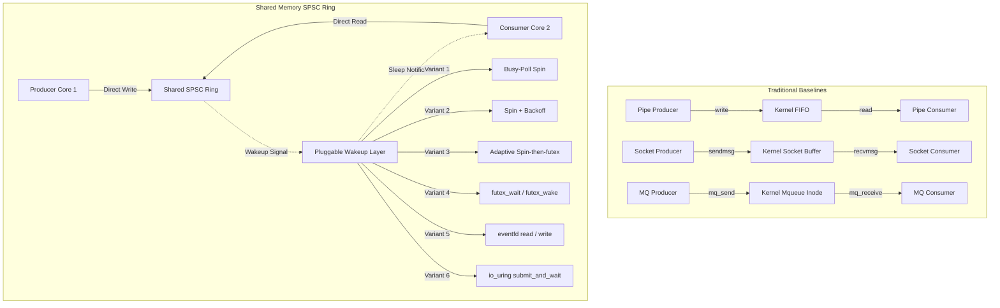

# How Much Does io_uring Help Shared-Memory IPC? A Measurement Study of Wakeup Mechanisms for Lock-Free SPSC Rings

This repository contains a comparative measurement study evaluating traditional kernel-mediated IPC mechanisms against a lock-free, cache-aligned Shared Memory SPSC Ring buffer. To isolate the real contribution of the asynchronous I/O framework (`io_uring`), the study implements a pluggable wakeup layer (ablation study) and evaluates end-to-end performance using a corrected depth-1 ping-pong latency measurement methodology.

---

## I. Architecture & Pluggable Wakeup Layer

The transport architecture maps a cache-aligned `RingBuffer` struct into POSIX shared memory. We vary only the mechanism used to coordinate blocking and wakeups:



---

## II. Benchmark Modes & Arrival Regimes

We isolate throughput from latency by supporting two separate execution modes:

1. **Throughput Mode (Saturated Stream)**: Streams 2 GB of data back-to-back. Supported regimes:
   - `saturated`: Producer streams back-to-back as fast as possible.
   - `bursty`: Producer writes a message and sleeps 1 ms (forcing the consumer to sleep and wake).
   - `offered`: Poisson rate limiter sweeps rates below saturation (e.g. 10k, 50k, 100k, 250k Hz).
2. **Latency Mode (Depth-1 Ping-Pong)**: Timer runs entirely on Client A using fenced `CLOCK_MONOTONIC_RAW` clock, eliminating cross-core clock synchronization issues. One-way latency is computed as RTT / 2 across $10^5$ round-trips.

---

## III. Repository Structure

```
.
├── src/                          # Source code folders for the IPC benchmark targets
│   ├── pipe/                     # POSIX Named Pipes benchmark directory
│   ├── sockets/                  # UNIX Domain Sockets benchmark directory
│   ├── mq/                       # POSIX Message Queue benchmark directory
│   └── io_uring/                 # Pluggable SPSC Ring benchmark directory (Ablation study)
│
├── data/                         # CSV results datasets and performance log data
│   ├── pipe_throughput.csv
│   ├── pipe_latency.csv
│   ├── socket_throughput.csv
│   ├── socket_latency.csv
│   ├── mq_throughput.csv
│   ├── mq_latency.csv
│   ├── uring_<variant>_throughput.csv
│   └── uring_<variant>_latency.csv
│
├── scripts/                      # Visualization and statistical scripts
│   ├── generate_visualizations.py# Process CSV data and generate plots
│   └── statistical_analysis.py   # Run 95% Confidence Interval validation reports
│
├── figures/                      # Directory for generated publication assets
│   ├── throughput.png            # Throughput comparison chart (GB/s)
│   ├── latency.png               # Latency comparison chart (microseconds, Log Scale)
│   ├── speedup.png               # io_uring Speedup comparison chart
│   ├── cache_misses.png          # Cache miss rates comparison chart
│   ├── ablation_throughput.png   # Ablation study throughput comparison
│   ├── ablation_latency.png      # Ablation study latency comparison
│   └── statistical_analysis.md   # Statistical validation report
│
├── run_all.sh                    # Master script to run all tests automatically
└── ipc_implementation_documentation.md # Detailed cross-implementation narrative
```

---

## IV. Execution and Reproducibility

### A. System Configuration Check
Ensure compile tools, shared library symbols, and runtime packages are installed:
```bash
# Ubuntu/Debian dependencies
sudo apt-get update
sudo apt-get install -y build-essential liburing-dev python3-matplotlib python3-scipy perf-tools-unstable
```

### B. Run Everything (Baselines + Ablation + Visualizations)
To execute all test configurations sequentially and automatically generate figures, run the master script from the repository root:
```bash
bash run_all.sh
```

### C. Run Individual Benchmarks Manually
You can run individual benchmarks in either throughput or latency mode:

- **POSIX Pipe**:
  ```bash
  cd src/pipe && bash run_pipe_bench.sh throughput   # Or latency
  ```
- **Unix Sockets**:
  ```bash
  cd src/sockets && bash run_socket_bench.sh throughput  # Or latency
  ```
- **POSIX Message Queue**:
  ```bash
  cd src/mq && bash run_mq_bench.sh throughput   # Or latency
  ```
- **SHM SPSC Ring (Wakeup Ablation)**:
  ```bash
  cd src/io_uring
  # Run throughput with a specific wakeup mechanism
  bash run_uring_bench.sh --mode throughput --wakeup futex
  # Run latency (ping-pong) with a specific wakeup mechanism
  bash run_uring_bench.sh --mode latency --wakeup uring
  ```
