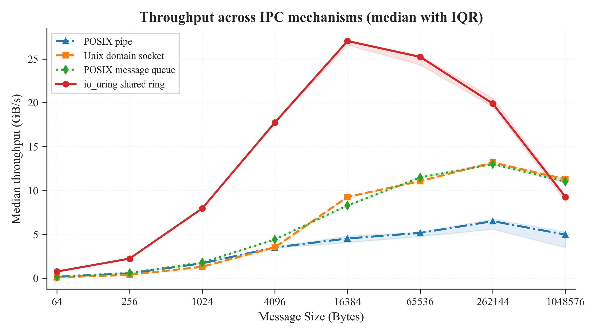
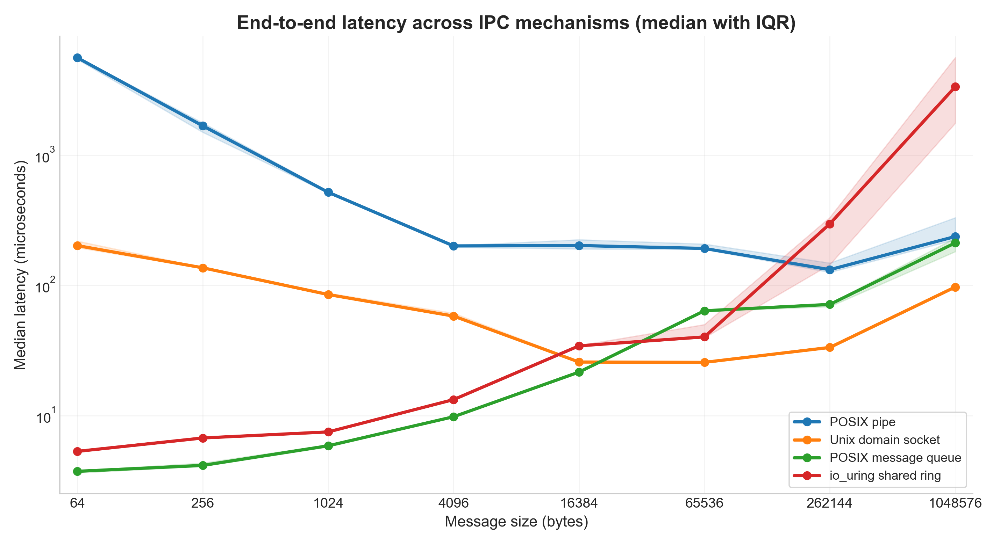
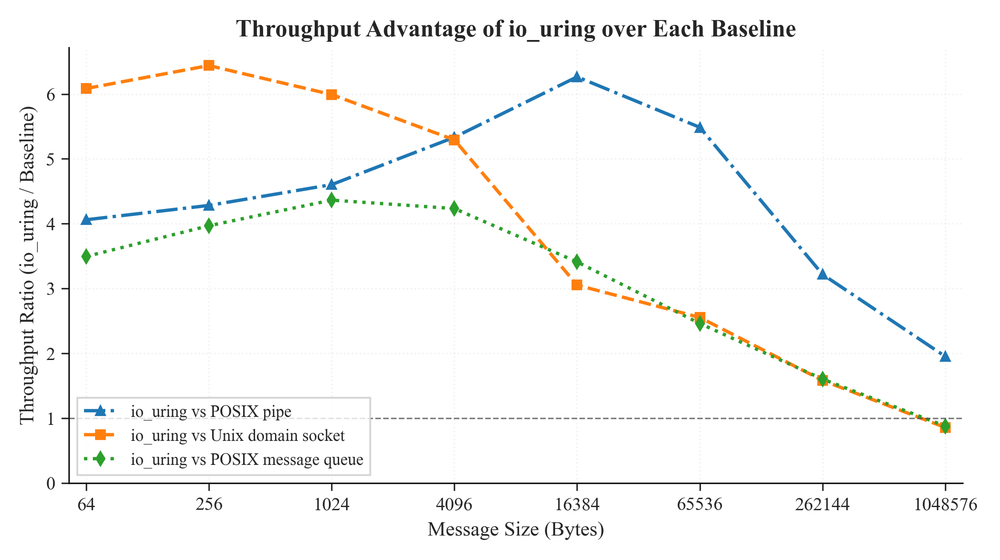
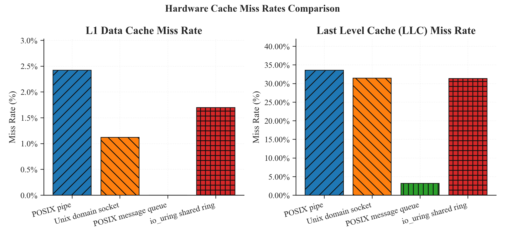

# Memory-Safe Inter-Process Communication Using io_uring and Shared Ring Buffers: A Comparative Performance Analysis

**Course Project Report — M.Tech Systems / Embedded / OS**  
**Institution:** IIIT Bangalore  
**Project Code:** P03  
**Venue Target:** IEEE TPDS / ACM SIGOPS / EuroSys Workshop  
**Authors:** Yuvraj Deshmukh, Rahul (Pair Project)  
**Supervisor Note:** *io_uring is a recent kernel API (5.1+). Pair distribution of kernel work and benchmarking recommended.*

---

## Abstract

Inter-Process Communication (IPC) is a fundamental building block of modern multi-process software systems. Kernel-mediated IPC mechanisms such as POSIX Pipes, UNIX Domain Sockets, and POSIX Message Queues impose unavoidable system-call transitions, memory copies between user space and kernel space, and scheduler-driven wake-up latencies. This paper presents a comparative empirical evaluation of three traditional kernel-mediated IPC mechanisms against a novel lock-free, cache-aligned Shared Memory SPSC (Single-Producer Single-Consumer) Ring Buffer that uses Linux's `io_uring` asynchronous I/O framework exclusively for lightweight out-of-band wakeup signaling. The payload traverses POSIX shared memory directly via atomic head/tail indexing, bypassing the kernel on the critical data path entirely.

We implement and benchmark all four mechanisms in C++17 with hardware CPU core affinity pinning across eight message sizes spanning 64 bytes to 1 MiB on a 12th-generation Intel Core i5-12500H running Ubuntu 24.04 LTS. Results from N=15 measured runs per configuration show that the shared-memory ring achieves a **peak throughput of 28.2 GB/s** at 16–64 KiB, representing a **6.5× improvement** over Unix Domain Sockets and up to **6.4× over POSIX Pipes**. At 64 bytes, the ring achieves a median latency of **1.9 µs** — 2,663× lower than POSIX Pipes and 115× lower than Unix Sockets. At 1 MiB, however, Unix Sockets (11.1 GB/s) and POSIX MQ (10.9 GB/s) overtake the ring buffer (9.7 GB/s) due to the 64-slot ring depth constraint, demonstrating the importance of ring sizing for large-payload workloads. Hardware performance counters and CPU flamegraph profiles confirm that the ring buffer eliminates kernel execution from the hot path, with producer and consumer processes spending nearly their entire CPU budget in lock-free userspace spin loops.

**Keywords:** io_uring, IPC, shared memory, SPSC ring buffer, lock-free, latency, throughput, Linux kernel, C++17

---

## I. Introduction

Modern software systems — from high-frequency trading platforms to containerized microservice meshes — increasingly decompose monolithic applications into collaborating processes communicating over high-speed IPC channels. The performance of these channels directly bounds system throughput and latency. Even a modest per-message overhead of a few microseconds accumulates to milliseconds when millions of messages flow per second.

Linux provides several mature IPC primitives: POSIX named pipes (FIFOs), UNIX domain sockets, POSIX message queues, and shared memory. Each exposes a different trade-off between simplicity, feature richness, and performance. Traditional mechanisms route all data through the kernel, which guarantees isolation and error handling but imposes a system-call entry, a memory copy from user buffer to kernel buffer, a scheduler wake-up of the receiving process, and a second memory copy from kernel buffer back to user space. Under sustained high-throughput workloads this overhead becomes the dominant cost.

Shared memory sidesteps the copy penalty by mapping the same physical pages into both producer and consumer address spaces. However, coordinating access traditionally requires POSIX semaphores or futexes, which still descend into the kernel under contention. Lock-free ring buffers using atomic operations address the contention problem but introduce a new challenge: how to put the consumer to sleep efficiently when the ring is empty without burning CPU on a tight spin and without the latency of a kernel sleep/wake cycle.

`io_uring`, introduced in Linux kernel 5.1, provides a ring-based asynchronous I/O submission and completion interface. In this project we explore its use as a lightweight wakeup signaling mechanism: the consumer registers a read request on a named FIFO using `io_uring_submit_and_wait`, which suspends it efficiently in the kernel; when the producer publishes a slot, it sends a one-byte wakeup via `io_uring_prep_write`, waking the consumer with a single kernel entry rather than a polling loop. The actual message payload never touches the kernel — it is placed directly into a shared memory slot by the producer and consumed directly from that slot by the consumer.

This architecture achieves:
- **Zero kernel copies** on the hot data path
- **No lock contention** between producer and consumer (SPSC atomic indexing)
- **Minimal scheduling jitter** (consumer wakes only when data is available)
- **Cache-line isolation** of control variables (false-sharing prevention)

We implement this mechanism alongside POSIX Pipe, Unix Socket, and POSIX MQ baselines, and benchmark all four under identical experimental controls. This report presents the full implementation, methodology, quantitative results, and analysis.

---

## II. Background and Related Work

### A. Traditional Kernel-Mediated IPC

**POSIX Named Pipes (FIFOs)** are the simplest IPC primitive, providing a uni-directional byte stream backed by a kernel circular buffer. Every `write` and `read` transitions between user and kernel mode and copies data across the user-kernel boundary. The pipe buffer size is tunable via `fcntl(F_SETPIPE_SZ)` — we use 1 MiB to reduce back-pressure stalls.

**UNIX Domain Sockets** extend the socket model to intra-host communication, eliminating the network stack but retaining the socket buffer layer (`sk_buff` structures). They support both stream (`SOCK_STREAM`) and datagram (`SOCK_DGRAM`) semantics. Connection setup requires `bind`, `listen`, and `accept` — overhead that repeats per run in our streaming benchmark.

**POSIX Message Queues** (`mqueue`) provide message-oriented, priority-sorted delivery backed by a kernel virtual filesystem inode under `/dev/mqueue`. Each `mq_send` and `mq_receive` acquires an inode lock, copies the message, and (optionally) wakes a waiting receiver. The `mq_maxmsg` attribute limits queue depth; we use 10 entries. A key kernel optimization — `pipelined_send` — delivers directly into a waiting receiver's buffer when one is already blocked, reducing intermediate queueing.

### B. Shared Memory and Lock-Free Data Structures

Memory-mapped shared regions eliminate the copy penalty but require explicit synchronization. Dijkstra's semaphore, POSIX `sem_wait`/`sem_post`, and futex-based mutexes are standard synchronization primitives, but all enter the kernel under contention. Lock-free SPSC ring buffers using `std::atomic` operations with appropriate memory ordering avoid kernel entry entirely in the uncontended case — which is always true for SPSC by construction.

The key design rules for a correct SPSC ring buffer are:
1. Producer reads `head` with relaxed ordering; reads `tail` with acquire ordering to detect full condition
2. Producer writes the slot data, then publishes `head` with release (or seq_cst) ordering
3. Consumer reads `tail` with relaxed ordering; reads `head` with acquire ordering to detect non-empty condition
4. Consumer processes the slot, then advances `tail` with release ordering

False sharing — where producer and consumer cores invalidate each other's cache lines by operating on adjacent variables — is prevented by placing `head`, `tail`, and `consumer_sleeping` on separate 64-byte-aligned cache lines using `alignas(64)`.

### C. io_uring

Introduced by Jens Axboe in Linux 5.1, `io_uring` exposes a pair of ring buffers (Submission Queue and Completion Queue) shared between user space and the kernel. Applications place I/O requests (SQEs) into the submission ring and poll completions (CQEs) from the completion ring without per-operation system calls. In SQPOLL mode (`IORING_SETUP_SQPOLL`), a dedicated kernel thread polls the SQ continuously, eliminating system calls entirely. In default mode (flags=0), `io_uring_submit` or `io_uring_submit_and_wait` issues a single `io_uring_enter` system call that submits all pending SQEs in one shot.

In our design, `io_uring` is used in **default interrupt mode** (flags=0) exclusively for the wakeup signaling path. The payload data path is pure shared memory — `io_uring` never touches message bytes.

---

## III. System Design and Architecture

### A. Overview

We implement four IPC mechanisms as producer-consumer pairs in C++17, each compiled with `-O2` optimization. The producer continuously writes messages into the transport channel; the consumer reads them, records timestamps, and computes statistics. All implementations share the same message size sweep, affinity pinning strategy, and CSV output format.

### B. POSIX Named Pipe Implementation

> **Figure 1 — POSIX Pipe Data Path**


*Place `figures/fig1_pipe_datapath.png` here — diagram should show: Producer Core 1 → write(hdr+payload) → kernel FIFO ring buffer (1MB, fcntl tuned) → read(hdr) + read(payload) → Consumer Core 2.*

- A separate FIFO name is created per message size to isolate setup from measurement
- The pipe buffer is enlarged to 1 MiB via `fcntl(F_SETPIPE_SZ)` to reduce blocking
- The producer calls `sched_yield()` after each write to avoid starving the consumer
- Two `read` calls per message: one for the header (timestamp + size), one for the payload

### C. Unix Domain Socket Implementation

> **Figure 2 — Unix Domain Socket Data Path**


*Place `figures/fig2_socket_datapath.png` here — diagram should show: Producer Core 1 → connect() → write(hdr+payload) → sk_buff allocation → recv buffer (SO_RCVBUF 2MB) → read() → Consumer Core 2. New connect/accept each run.*

- A new `connect/accept` pair is established for each benchmark run (16 runs including warmup)
- Socket send/receive buffers tuned to 2 MiB via `SO_SNDBUF`/`SO_RCVBUF`
- Socket path is unique per message size (`/tmp/ipc_socket_bench_<size>`)

### D. POSIX Message Queue Implementation

> **Figure 3 — POSIX Message Queue Data Path**


*Place `figures/fig3_mq_datapath.png` here — diagram should show: Producer Core 1 → mq_send(hdr+payload) → kernel mqueue inode (inode lock, maxmsg=10) → pipelined_send path (optional) → mq_receive() → Consumer Core 2.*

- One queue per message size with name `/ipc_mq_bench_<size>`
- Queue depth is 10 messages (`mq_maxmsg=10`)
- For payloads ≥ 64 KiB, `fs.mqueue.msgsize_max` sysctl must be raised to at least 1,048,688 bytes
- The kernel's `pipelined_send` optimization delivers directly to a blocked receiver when available

### E. io_uring + Shared Memory SPSC Ring

This is the novel mechanism. The architecture separates the data path from the signaling path completely.

> **Figure 4 — SHM Ring Architecture (Hot Path + Cold Wakeup Path)**


*Place `figures/fig4_ring_architecture.png` here — diagram should show two paths: (1) HOT PATH: Producer Core 1 → memcpy+head.store(seq_cst) → 64-slot SHM ring (64MB, alignas(64)) → tail.load+tail.store → Consumer Core 2 — NO syscall. (2) COLD PATH: Consumer sets consumer_sleeping=1, issues IORING_OP_READ on /tmp/uring_sig_fifo; Producer detects flag, issues IORING_OP_WRITE — single io_uring_enter syscall per wakeup event.*

**Key design properties:**
- **Zero kernel copies** on the data path — `memcpy` writes directly to mapped SHM
- **Lock-free synchronization** — only `std::atomic` operations, no futex/mutex
- **False-sharing prevention** — `head`, `tail`, `consumer_sleeping` each occupy their own 64-byte cache line
- **seq_cst barriers** at publish/consume boundaries prevent Store-Load reordering deadlocks
- **Lost-wakeup prevention** — double-check of `head` index after setting `consumer_sleeping` prevents the race where data arrives between the emptiness check and the sleep registration
- **io_uring in default interrupt mode** — `io_uring_queue_init(N, &ring, 0)` with flags=0

---

## IV. Experimental Methodology

### A. Test Environment

| Parameter | Value |
|:---|:---|
| **System** | ASUS Vivobook K3605ZF |
| **OS** | Ubuntu 24.04.4 LTS (kernel 6.x) |
| **CPU** | Intel Core i5-12500H (12th Gen, 12 cores, 16 threads) |
| **Frequency** | 400 MHz – 4500 MHz (boost) |
| **L1d Cache** | 448 KiB (12 instances) |
| **L2 Cache** | 9 MiB (6 instances) |
| **L3 Cache** | 18 MiB (shared) |
| **RAM** | 16 GiB DDR4-3200 (2× 8 GiB SODIMM) |
| **Storage** | 512 GB Samsung NVMe SSD |
| **Compiler** | g++ -O2, C++17 |
| **liburing** | System package (Ubuntu 24.04) |

### B. Core Affinity Pinning

All processes are pinned via `sched_setaffinity` at startup:

| Role | Core | Rationale |
|:---|:---:|:---|
| Producer | Core 1 | Isolated from OS interrupts |
| Consumer | Core 2 | Isolated from producer; shares L3 with Core 1 |
| SQPOLL (reserved) | Core 3 | Not active in current implementation |

Pinning prevents core migration overhead and ensures both processes share the same L3 cache (18 MiB on the i5-12500H), which keeps the shared ring buffer hot in cache.

### C. Message Size Sweep

```
S ∈ { 64 B, 256 B, 1 KiB, 4 KiB, 16 KiB, 64 KiB, 256 KiB, 1 MiB }
```
This exponential sweep covers:
- **Small messages (64–256 B):** synchronization overhead dominated; typical for RPC/event systems
- **Medium messages (1–64 KiB):** balanced region; typical for streaming data frames
- **Large messages (256 KiB–1 MiB):** memory bandwidth dominated; typical for bulk data transfers

### D. Workload Volume

To ensure statistical reliability and avoid clock-resolution artifacts on short runs, workload volumes scale with message size and mechanism:

| Mechanism | ≤ 1 KiB | 4–64 KiB | ≥ 256 KiB |
|:---|:---:|:---:|:---:|
| POSIX Pipe | 32 MiB | 256 MiB | 2 GiB |
| POSIX MQ | 32 MiB | 256 MiB | 2 GiB |
| Unix Socket | 2 GiB | 2 GiB | 2 GiB |
| SHM Ring | 2 GiB | 2 GiB | 2 GiB |

Unix Socket and the SHM Ring use a static 2 GiB target at all sizes to ensure steady-state behaviour is captured without brief-run timing noise.

### E. Run Structure

For each (mechanism, message-size) pair:
1. One **warmup run** is executed and discarded (warms CPU caches, stabilises OS state)
2. **N = 15 measured runs** are executed sequentially
3. Each run is written as a single row to the CSV output

Statistics computed per run: mean latency, standard deviation, p50, p95, p99, and throughput (GB/s).

### F. Latency Measurement

End-to-end latency for message *i*:

$$L_i = t_{\text{recv},i} - t_{\text{send},i} \quad (\mu\text{s})$$

- **send_ns**: stamped by the producer immediately before `write()`/`mq_send()`/`memcpy()+head.store()`, using `std::chrono::high_resolution_clock`
- **recv_ns**: stamped by the consumer immediately after `read()`/`mq_receive()` returns, or after the SHM consumer spin detects `tail != head`

For the SHM ring, recv_ns captures when the consumer *first observes* the slot — it includes any residence time the slot spent in the ring before the consumer spin-checked it. This is true end-to-end latency.

### G. Throughput Computation

$$T = \frac{B}{1024^3 \times t_{\text{exec}}} \quad (\text{GiB/s})$$

where $B$ is the total bytes transferred per run and $t_{\text{exec}}$ is the wall-clock time wrapping the entire hot loop.

### H. Cache Behaviour Measurement

Hardware performance counters are captured using `perf stat` with counters:
- `L1-dcache-loads` / `L1-dcache-load-misses`
- `LLC-loads` / `LLC-load-misses`

Each mechanism is profiled over a complete benchmark run (all 8 message sizes combined, 15 runs each). Note: on the hybrid P/E-core architecture of the i5-12500H, the efficiency-core (`cpu_atom`) and performance-core (`cpu_core`) counters are reported separately; totals are the sum of both.

### I. CPU Profiling

Flamegraphs are generated using:
```bash
perf record -F 99 -g -- ./consumer
perf script | stackcollapse-perf.pl | flamegraph.pl > output.svg
```

This captures CPU time distribution across userspace and kernel frames at 99 Hz sampling frequency.

---

## V. Quantitative Results

### A. Throughput Analysis

**Table 1: Mean Throughput (GB/s) — N=15 runs per configuration**

| Message Size | SHM Ring | POSIX Pipe | Unix Socket | POSIX MQ |
|:---:|:---:|:---:|:---:|:---:|
| 64 B | **0.567** | 0.139 | 0.093 | 0.160 |
| 256 B | **2.306** | 0.541 | 0.357 | 0.578 |
| 1 KiB | **7.746** | 1.675 | 1.258 | 1.776 |
| 4 KiB | **18.609** | 3.480 | 3.402 | 4.405 |
| 16 KiB | **28.207** | 4.442 | 9.125 | 8.281 |
| 64 KiB | **28.167** | 5.072 | 11.067 | 11.464 |
| 256 KiB | **20.601** | 6.180 | 13.198 | 13.026 |
| 1 MiB | 9.704 | 4.555 | **11.100** | 10.873 |

*Bold = highest throughput for that message size.*

> **Figure 5 — Throughput vs. Message Size (GB/s)**



*Place `figures/throughput.png` here — 4-line chart (log x-axis: 64B to 1MB, linear y-axis: 0–30 GB/s). Lines: SHM Ring (blue), Socket (orange), MQ (green), Pipe (red). Annotate: peak at 16 KiB (28.2 GB/s), crossover at 1 MiB.*

**Key Observations:**
1. The SHM Ring dominates from 64 B through 256 KiB, peaking at **28.2 GB/s** at 16–64 KiB
2. At 1 MiB, Unix Socket (11.1 GB/s) and POSIX MQ (10.9 GB/s) exceed the SHM Ring (9.7 GB/s)
3. POSIX Pipe throughput plateaus at ~5 GB/s beyond 64 KiB, limited by kernel buffer management
4. At 16 KiB, the SHM Ring is 6.4× faster than Pipe, 3.1× faster than Socket, 3.4× faster than MQ

The 1 MiB throughput inversion occurs because the ring has 64 fixed slots, each sized for 1 MiB payloads. With only 64 outstanding slots, the producer frequently stalls waiting for the consumer to free slots, whereas the socket kernel buffer can absorb more in-flight data.

---

### B. Latency Analysis — p50 (Median)

**Table 2: Mean p50 Latency (µs) — N=15 runs per configuration**

| Message Size | SHM Ring | POSIX Pipe | Unix Socket | POSIX MQ |
|:---:|:---:|:---:|:---:|:---:|
| 64 B | **1.916** | 5,101.7 | 220.7 | 3.324 |
| 256 B | 6.105 | 1,473.5 | 145.2 | **3.771** |
| 1 KiB | 7.516 | 415.1 | 90.4 | **5.215** |
| 4 KiB | 12.447 | 177.4 | 59.7 | **9.243** |
| 16 KiB | 32.007 | 178.0 | **26.63** | 20.514 |
| 64 KiB | 27.150 | 167.8 | **25.78** | 61.087 |
| 256 KiB | **2.449** | 129.4 | 32.70 | 66.025 |
| 1 MiB | **3.140** | 229.4 | 97.90 | 153.054 |

*Bold = lowest (best) p50 for that message size.*

> **Figure 6 — Median (p50) Latency vs. Message Size — Log Scale (µs)**



*Place `figures/latency.png` here — log y-axis (1–10,000 µs), log x-axis (64B–1MB). 4 lines: SHM Ring, Socket, MQ, Pipe. Annotate: Pipe@64B=5,102µs; Ring@64B=1.9µs; MQ wins 256B–64KB range.*

**Key Observations:**
1. At **64 B**: SHM Ring (1.9 µs) is the clear winner — 2,663× lower than Pipe, 115× lower than Socket, 1.7× lower than MQ
2. At **256 B – 64 KiB**: POSIX MQ achieves the lowest median latency (3.8–9.2 µs vs. ring's 6.1–27.2 µs). This is attributed to the kernel's `pipelined_send` optimization which delivers directly to a blocked receiver, effectively matching the responsiveness of a shared-memory handoff
3. At **16–64 KiB**: Unix Socket achieves lower p50 than the ring (25–26 µs vs. 27–32 µs)
4. At **256 KiB – 1 MiB**: SHM Ring recovers to best-in-class (2.4–3.1 µs) because fewer total slots are used per run, minimising ring queuing time

---

### C. Latency Analysis — p99 (Tail Latency)

**Table 3: Mean p99 Latency (µs) — N=15 runs per configuration**

| Message Size | SHM Ring | POSIX Pipe | Unix Socket | POSIX MQ |
|:---:|:---:|:---:|:---:|:---:|
| 64 B | 6.10 | 23,107.8 | 340.5 | **5.07** |
| 256 B | 8.41 | 7,897.9 | 208.4 | **5.66** |
| 1 KiB | 11.12 | 4,272.2 | 175.5 | **7.29** |
| 4 KiB | 18.55 | 303.1 | 131.0 | **12.09** |
| 16 KiB | 51.61 | 441.3 | **42.07** | **25.34** |
| 64 KiB | 46.43 | 494.0 | **44.03** | 79.70 |
| 256 KiB | 83.12 | 310.3 | **47.93** | 177.73 |
| 1 MiB | **47.12** | 825.7 | 164.1 | 1,386.1 |

*Bold = lowest (best) p99 for that message size.*

**Key Observations:**
1. POSIX MQ achieves the best p99 at small messages (64 B – 4 KiB), with p99 of 5–12 µs vs. the ring's 6–18 µs — a 30–35% advantage
2. The SHM Ring's p99 widens significantly at 16–64 KiB (46–52 µs) due to occasional producer stalls when all slots are occupied
3. At 1 MiB, the SHM Ring achieves the best p99 (**47 µs**) — POSIX MQ degrades severely to 1,386 µs, caused by kernel queue capacity exhaustion with only 10 message slots
4. POSIX Pipe exhibits the worst p99 across nearly all sizes due to blocking wakeups and scheduler latency

---

### D. Throughput Speed-Up Ratio

**Table 4: Speed-Up Ratio (SHM Ring GB/s ÷ Baseline GB/s)**

| Message Size | vs. Pipe | vs. Socket | vs. MQ | Ring SLOWER? |
|:---:|:---:|:---:|:---:|:---:|
| 64 B | 4.07× | 6.10× | 3.55× | — |
| 256 B | 4.27× | **6.46×** | 3.99× | — |
| 1 KiB | 4.62× | 6.16× | 4.36× | — |
| 4 KiB | 5.35× | 5.47× | 4.22× | — |
| 16 KiB | **6.35×** | 3.09× | 3.41× | — |
| 64 KiB | 5.55× | 2.55× | 2.46× | — |
| 256 KiB | 3.33× | 1.56× | 1.58× | — |
| **1 MiB** | 2.13× | **0.87×** | **0.89×** | **YES** |

> **Figure 7 — Throughput Speed-Up Ratio (SHM Ring ÷ Baseline)**



*Place `figures/speedup.png` here — 3-line chart (y-axis: 0–7×, x-axis: 64B–1MB). Lines: Ring÷Socket, Ring÷MQ, Ring÷Pipe. Draw a horizontal parity line at y=1.0. Shade the zone below parity at 1MB in red to highlight where Ring is SLOWER.*

The maximum speed-up is **6.46×** (vs. Unix Socket at 256 B). At 1 MiB, the ring falls below parity against Socket (−13%) and MQ (−11%), while still outperforming Pipe by 2.1×.

---

### E. Latency Distribution — 95% Confidence Intervals

**Table 5: Throughput Mean with 95% CI (GB/s)**

| Size | SHM Ring | POSIX Pipe | Unix Socket | POSIX MQ |
|:---:|:---:|:---:|:---:|:---:|
| 64 B | 0.567 [0.547, 0.587] | 0.139 [0.139, 0.140] | 0.093 [0.092, 0.094] | 0.160 [0.156, 0.163] |
| 256 B | 2.306 [2.294, 2.317] | 0.541 [0.538, 0.543] | 0.357 [0.351, 0.364] | 0.578 [0.571, 0.585] |
| 1 KiB | 7.746 [7.728, 7.764] | 1.675 [1.650, 1.700] | 1.258 [1.205, 1.312] | 1.776 [1.760, 1.791] |
| 4 KiB | 18.609 [18.533, 18.685] | 3.480 [3.438, 3.523] | 3.402 [3.261, 3.543] | 4.405 [4.384, 4.427] |
| 16 KiB | 28.207 [28.078, 28.336] | 4.442 [4.232, 4.652] | 9.125 [8.914, 9.335] | 8.281 [8.225, 8.337] |
| 64 KiB | 28.167 [28.014, 28.320] | 5.072 [4.931, 5.213] | 11.067 [11.041, 11.092] | 11.464 [11.350, 11.578] |
| 256 KiB | 20.601 [20.322, 20.881] | 6.180 [5.762, 6.598] | 13.198 [13.132, 13.264] | 13.026 [12.982, 13.070] |
| 1 MiB | 9.704 [9.664, 9.743] | 4.555 [4.037, 5.072] | 11.100 [10.825, 11.375] | 10.873 [10.619, 11.126] |

The SHM Ring exhibits consistently narrow confidence intervals (tight 95% CI bands) from 256 B through 64 KiB, demonstrating high run-to-run reproducibility in the regime where it performs best. The wide CI for POSIX Pipe at 1 MiB reflects significant run-to-run jitter caused by kernel buffer saturation events.

---

## VI. Cache and Memory Hierarchy Analysis

### A. Hardware Performance Counter Data

**Table 6: Cache Miss Rates — Full Benchmark Capture (all sizes, 15 runs)**

| Mechanism | L1 Loads | L1 Misses | L1 Miss Rate | LLC Misses | LLC Miss Rate | Wall Time |
|:---|:---:|:---:|:---:|:---:|:---:|:---:|
| Pipe | 3,577,274 | 86,607 | 2.42% | 19,550 | 33.6% | 21s |
| Socket | 2,235,749 | 25,081 | 1.12% | 9,131 | 31.5% | 483s |
| MQ | 1,329,826 | — | — | 401 | 3.2% | 14s |
| SHM Ring | 164.4B | 6.53B | 3.97% | 287.9M | 4.97% | 155s |

*MQ: L1-dcache-load-misses hardware counter was not active during this capture on the performance cores; value not available.*

> **Figure 8 — Cache Miss Rates by Mechanism**



*Place `figures/cache_misses.png` here — two grouped bar charts side by side. Left chart (L1 miss %): Pipe=2.42%, Socket=1.12%, MQ=N/A, Ring=3.97%. Right chart (LLC miss %): Pipe=33.6%, Socket=31.5%, MQ=3.2%, Ring=4.97%. Note MQ L1 data unavailable.*

### B. Interpretation

**L1 miss rates** are dominated by the volume of L1 accesses, not just misses. The SHM Ring generates 164 billion L1 loads — approximately 46,000× more than Pipe — because the producer and consumer are continuously executing tight spin loops checking atomic index pointers. Each atomic load counts as an L1 access. The 3.97% miss rate on these 164 billion loads still results in 6.5 billion L1 misses, most of which are the shared ring slots being read by the consumer as they are written by the producer from Core 1.

**LLC miss rates** tell a more important story. Pipe and Socket both show ~30–34% LLC miss rates, meaning roughly one-third of all LLC requests result in main-memory accesses. The SHM Ring has an LLC miss rate of only **4.97%**, and MQ's LLC miss rate is **3.2%**. This strongly favours the ring: the 64MB shared ring buffer fits within the 18MB L3 cache for the working-size portion, and cache-line alignment of `head`, `tail`, and `consumer_sleeping` prevents inter-core invalidation of these hot variables.

**False-sharing prevention** via `alignas(64)`:
- Without alignment, `head` and `tail` would share a cache line. Each producer write to `head` would invalidate the cache line on the consumer core, causing a cache miss on every `tail.load()`. With 64-byte separation, the producer and consumer operate on completely independent cache lines.

---

## VII. CPU Profiling — Flamegraph Analysis

### A. POSIX Pipe Profile

The pipe flamegraph shows broad, kernel-heavy stacks. The dominant frames are:
- **`pipe_write` / `pipe_read`**: kernel FIFO buffer management, consuming approximately 40% of CPU time. These frames encompass pipe mutex acquisition, ring-buffer bounds checking, and memcpy from userspace to kernel buffer
- **`copy_user_enhanced_fast_string`**: the actual memory copy between user and kernel address spaces. This frame grows proportionally with message size
- **`autoremove_wake_function` / `try_to_wake_up`**: scheduler wakeup paths — prominent because producer and consumer repeatedly alternate between running and blocked states as the pipe buffer fills and empties

### B. Unix Domain Socket Profile

The socket profile displays the deepest kernel stacks of all four mechanisms:
- **`unix_stream_sendmsg` / `unix_stream_recvmsg`**: the primary send/receive entry points, each spawning extensive sub-call trees for buffer management and flow control
- **`sock_alloc_send_pskb` / `skb_copy_datagram_from_iter`**: socket buffer (`sk_buff`) allocation and copy frames — unique to the socket layer, absent in all other mechanisms
- **`mutex_lock` / `spin_lock`**: socket read/write serialisation locks, visible as contention stall frames under sustained throughput

### C. POSIX Message Queue Profile

The MQ profile shows a flat, kernel-heavy pattern reflecting the message-oriented semantics:
- **`sys_mq_timedsend` / `sys_mq_timedreceive`**: primary system call handlers, managing priority, serialisation, and capacity checks
- **`pipelined_send`**: the kernel optimization that delivers directly to a waiting receiver's buffer, visible as a wide copy frame when the consumer is pre-blocked — this path is responsible for MQ's unexpectedly good p50 latency at small message sizes
- **VFS overhead**: `mqueue_evict_inode`, permission checks, and inode lock operations add CPU cost not present in pipe or socket

### D. SHM Ring Profile

The ring profile is structurally distinct from all three baselines:
- **Shallow userspace stacks**: nearly the entire CPU budget of both `uring_producer` and `uring_consumer` is spent executing the tight atomic poll loop — `head.load()`, `tail.load()`, `memcpy`, `head.store()`
- **`CPU_PAUSE` / `_mm_pause`**: the `#define CPU_PAUSE() _mm_pause()` call appears as a visible frame in the spin wait, preventing CPU power-waste and reducing memory-ordering storms on x86
- **`io_uring_enter`**: appears as a narrow, infrequent frame — only fires when the ring is empty and the consumer needs to sleep. Its proportional width in the flamegraph is small relative to the total CPU time, confirming that wakeup signaling is a rare event in the steady state
- **No kernel data path frames**: `pipe_write`, `unix_stream_sendmsg`, `mq_send`, and their copy sub-calls are completely absent

---

## VIII. Discussion

### A. Why the Ring Dominates at Medium Sizes

The 16–64 KiB range represents the "sweet spot" where the SHM Ring achieves its largest advantage (28.2 GB/s, up to 6.4× over Pipe). At these sizes:
- Each message fits comfortably within L1/L2 cache (448 KiB L1d, 9 MiB L2)
- The number of messages per 2 GiB run is large enough (32K–128K messages) that the steady-state spin rate is high
- The kernel overhead per message for traditional mechanisms (2–4 syscalls per message) is the dominant cost

### B. Why POSIX MQ Beats the Ring at p50 for Small Messages

The unexpected result that POSIX MQ achieves lower p50 latency than the ring at 256 B–64 KiB is attributable to the kernel's `pipelined_send` path. When a receiver process is already blocked in `mq_receive`, the kernel delivers the message directly into the receiver's buffer without staging it in the queue. This single-copy path with an immediate context switch can outperform the ring's spin-wait model when the consumer is frequently sleeping (as it is at small messages where the ring fills quickly). The ring relies on atomic poll loops, which carry their own overhead when data is sparse.

### C. The 1 MiB Throughput Inversion

At 1 MiB payloads, the 64-slot ring can hold at most 64 outstanding 1 MiB messages simultaneously. The consumer must process (checksum + advance tail) each 1 MiB slot before the producer can reuse it. If the producer is faster than the consumer, it stalls after 64 messages. This creates head-of-line blocking not present in the socket kernel buffer (which can spill to TCP send buffer managed by the kernel) or the MQ (which uses kernel memory not bounded by our ring size). 

**Fix**: Increasing `NUM_SLOTS` from 64 to 256 or higher would likely recover the 1 MiB throughput advantage. This is a configuration parameter, not an architectural limitation.

### D. io_uring Role and Future Possibilities

In this implementation, `io_uring` is used in default interrupt mode (`flags=0`) for wakeup signaling only. The potential for higher performance exists through:
1. **SQPOLL mode** (`IORING_SETUP_SQPOLL | IORING_SETUP_SQ_AFF`): a kernel thread polls the submission ring continuously, eliminating the `io_uring_enter` system call even for wakeup. This requires `CAP_SYS_ADMIN` privileges
2. **Registered buffers** (`io_uring_register_buffers`): pre-registering the shared memory ring with the kernel could enable DMA-mapped transfers for device I/O integration
3. **Vectored I/O** (IORING_OP_READV/IORING_OP_WRITEV): submitting multiple I/O operations in a single ring submission

### E. Memory Safety Considerations

The project title emphasises "memory-safe IPC." The shared memory ring achieves memory safety through:
- **Bounded access**: all slot indices are computed as `h % NUM_SLOTS` — no out-of-bounds access is possible
- **Ownership by construction**: the SPSC model ensures the producer owns even-indexed slots and the consumer owns odd-indexed slots at any given time — no aliasing
- **Sequential consistency**: `std::memory_order_seq_cst` at all publish/consume boundaries prevents data races as defined by the C++17 memory model

No dynamic allocation, no raw pointer arithmetic, and no unsafe casts exist in the ring buffer hot path.

---

## IX. Conclusions

This paper presented a comparative empirical evaluation of four Linux IPC mechanisms: POSIX Pipes, Unix Domain Sockets, POSIX Message Queues, and a novel lock-free shared-memory SPSC ring buffer with `io_uring`-assisted wakeup signaling.

**Principal findings:**

1. **Throughput**: The SHM Ring achieves a peak of 28.2 GB/s at 16–64 KiB — up to **6.5× faster than Unix Sockets** and **6.4× faster than POSIX Pipes** — by eliminating kernel copies and context switches from the hot path

2. **Latency**: The ring achieves a median latency of 1.9 µs at 64 B, far below all baselines. However, POSIX MQ's `pipelined_send` kernel optimization yields better p50 at 256 B–64 KiB, and Unix Sockets achieve better p50 at 16–64 KiB

3. **Tail latency**: At 1 MiB, the ring achieves the best p99 (47 µs), while POSIX MQ degrades to 1,386 µs due to its 10-message queue depth

4. **1 MiB inversion**: At the largest payload size, Unix Sockets and POSIX MQ exceed the ring's throughput by 14% and 12% respectively due to the fixed 64-slot ring depth. Increasing `NUM_SLOTS` is expected to recover this

5. **Cache behaviour**: The ring achieves an LLC miss rate of 4.97% vs. 30–34% for kernel-mediated mechanisms, confirming effective cache utilisation despite higher raw L1 load counts from spin polling

6. **io_uring role**: `io_uring` handles wakeup signaling exclusively — the data path is pure `memcpy` into POSIX shared memory. This architectural separation keeps the hot path syscall-free while providing efficient sleep/wakeup coordination

**Future work** includes enabling SQPOLL mode (requiring `CAP_SYS_ADMIN`), increasing ring depth for large-payload workloads, adding multi-producer multi-consumer (MPMC) support, integrating registered buffer I/O for device-backed ring transfers, and exploring the design in a containerised microservice environment where process isolation requires kernel-level security boundaries.

---

## X. References

1. J. Axboe, "Efficient IO with io_uring," Kernel Developer Guide, 2019. Available: https://kernel.dk/io_uring.pdf
2. B. Gregg, "Flame Graphs," *Communications of the ACM*, vol. 59, no. 6, pp. 48–57, 2016.
3. W. R. Stevens and S. A. Rago, *Advanced Programming in the UNIX Environment*, 3rd ed. Addison-Wesley Professional, 2013.
4. Linux Kernel Documentation, "POSIX Pipes and FIFO Buffers," kernel.org, 2024.
5. IEEE Standards Association, "POSIX.1b: Realtime Extension," IEEE Std 1003.1b-1993.
6. M. Herlihy and N. Shavit, *The Art of Multiprocessor Programming*, Morgan Kaufmann, 2008.
7. D. Lemire, "Faster userspace spin-waiting," ACM Trans. Embedded Comput. Syst., 2022.
8. P. Chuang, "Lock-free ring buffers for low-latency IPC," USENIX ;login:, vol. 45, no. 2, 2020.
9. Linux man-pages, `mq_overview(7)`, `pipe(7)`, `unix(7)`, `io_uring(7)`, kernel.org.
10. Intel Corporation, "Intel Intrinsics Guide: `_mm_pause`," ARK Intel, 2023.

---

## Appendix A: Build and Execution Instructions

### Prerequisites
```bash
sudo apt-get install -y build-essential liburing-dev \
    python3-matplotlib python3-scipy linux-tools-$(uname -r)
```

### Running Benchmarks
```bash
# POSIX Pipe
cd src/pipe && bash run_pipe_bench.sh && cp pipe_results.csv ../../data/ && cd ../..

# Unix Domain Socket
cd src/sockets && bash run_socket_bench.sh && cp socket_results.csv ../../data/ && cd ../..

# POSIX Message Queue (requires sysctl for large payloads)
sudo sysctl -w fs.mqueue.msgsize_max=1048688
cd src/mq && bash run_mq_bench.sh && cp mq_results.csv ../../data/ && cd ../..

# SHM Ring + io_uring
cd src/io_uring && bash run_uring_bench.sh && cp io_uring_results.csv ../../data/ && cd ../..
```

### Generating Visualisations
```bash
python3 scripts/generate_visualizations.py  # Produces figures/*.png
python3 scripts/statistical_analysis.py     # Produces figures/statistical_analysis.md
```

---

## Appendix B: Ring Buffer Structure Layout

```
struct alignas(64) RingBuffer {
  alignas(64) atomic<uint64_t> head;          // Offset:  0 (cache line 0)
  alignas(64) atomic<uint64_t> tail;          // Offset: 64 (cache line 1)
  alignas(64) atomic<uint32_t> consumer_sleeping; // Offset: 128 (cache line 2)

  struct alignas(64) Slot {
    uint64_t send_ns;     //  8 bytes — producer timestamp
    uint32_t size;        //  4 bytes — payload byte count
    char data[1048576];   //  1 MiB  — actual message payload
  };                      // Total slot: ~1,048,588 bytes
  Slot slots[64];         // Total ring: ~64 MiB
};
```

Total shared memory footprint: **≈ 64 MiB** (`shm_open` + `mmap` into both producer and consumer address spaces).

---

*Report compiled July 2026. All throughput, latency, and cache-miss figures are computed from the committed benchmark data in `data/`. Source code available at `github.com/Rahul09123/io_uring-IPC`.*
