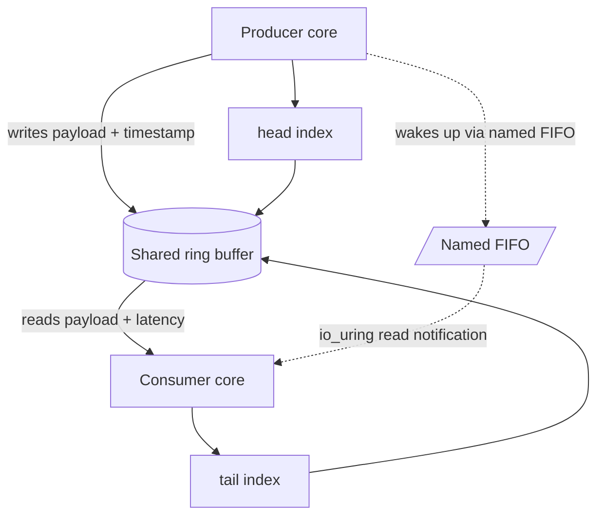

# IPC Implementation Documentation

## Overview

This repository benchmarks four IPC mechanisms under the same message-size sweep:

- POSIX pipes
- Unix domain sockets
- POSIX message queues
- io_uring with a shared-memory ring buffer

The benchmark uses a producer/consumer split and records throughput, latency, cache misses, and flamegraph traces. The implementations are not identical at the API level, but they share the same instrumentation strategy: the producer stamps each message with a send timestamp, the consumer reads that timestamp back, and both sides keep the payload large enough to exercise copy and synchronization overhead.

## Shared Benchmark Design

The shared header in each IPC folder defines the benchmark constants. The important values are:

- `MESSAGE_SIZES`: 64 B, 256 B, 1 KiB, 4 KiB, 16 KiB, 64 KiB, 256 KiB, 1 MiB
- `PRODUCER_CORE`: 1
- `CONSUMER_CORE`: 2
- `SQPOLL_CORE`: 3 for io_uring when SQPOLL is available
- `MAX_PAYLOAD`: 1 MiB
- `MAX_LAT_SAMPLES`: 4 MiB latency samples buffer

The implementations all include a `MessageHeader` with the send timestamp and payload size. The consumer uses that header to reconstruct end-to-end latency in microseconds.

The benchmark code also follows a simple measurement discipline:

1. Pin producer and consumer to separate cores.
2. Run one warmup iteration before the measured runs.
3. Sweep all message sizes for the current transport.
4. Scale workload volumes depending on the IPC mechanism:
   - **POSIX Pipes & POSIX Message Queues**: Dynamically scaled (32 MB for messages $\le 1$ KiB, 256 MB for $\le 64$ KiB, and 2 GB for larger messages) to optimize execution times.
   - **UNIX Domain Sockets & `io_uring` Shared Ring**: Static 2 GB workload across all message sizes.
5. Record throughput and latency statistics in CSV output.
6. Generate flamegraphs and cache-miss summaries for the accompanying analysis.

## POSIX Pipe Implementation

### Files

- `src/pipe/common.h`
- `src/pipe/pipe_producer.cpp`
- `src/pipe/pipe_consumer.cpp`
- `src/pipe/run_pipe_bench.sh`

### Data Path

The pipe version uses named FIFOs under `/tmp`. Each message size receives its own FIFO name so the benchmark can isolate setup overhead from the steady-state transfer loop.

Producer flow:

1. Pin to the producer core.
2. Build a wire buffer containing `MessageHeader + payload`.
3. Open the FIFO once per message-size class.
4. Increase the pipe size with `F_SETPIPE_SZ`.
5. Write message after message until the target byte count is reached.

Consumer flow:

1. Pin to the consumer core.
2. Create the FIFO for the current message size.
3. Open the FIFO once for reading.
4. Read the header and payload in blocking loops.
5. Measure latency using the embedded send timestamp.
6. Write aggregated statistics to `data/pipe_results.csv`.

### Implementation Notes

- The FIFO is recreated for every size class to keep the transport path isolated.
- The code performs a checksum pass over the payload so the benchmark exercises actual memory traffic.
- This implementation is the simplest one in the repository, but also the most likely to spend time in kernel-managed copy and wakeup paths.

## Unix Domain Socket Implementation

### Files

- `src/sockets/common.h`
- `src/sockets/socket_producer.cpp`
- `src/sockets/socket_consumer.cpp`
- `src/sockets/run_socket_bench.sh`

### Data Path

The socket benchmark uses `AF_UNIX` `SOCK_STREAM` sockets. Each message size maps to a different filesystem socket path under `/tmp`.

Producer flow:

1. Pin to the producer core.
2. Allocate a message buffer with a header and payload.
3. Create a Unix domain socket.
4. Set `SO_SNDBUF` to reduce trivial buffer pressure.
5. Retry `connect` until the consumer has bound the socket.
6. Stream payloads until the byte target is reached.

Consumer flow:

1. Pin to the consumer core.
2. Create a listening socket.
3. Set `SO_RCVBUF` for a larger receive window.
4. Bind and listen on the size-specific socket path.
5. Accept the producer connection.
6. Read the header and payload in a loop, then record throughput and latency statistics in `data/socket_results.csv`.

### Implementation Notes

- The retry loop in the producer ensures the benchmark is robust against race conditions during listener startup.
- The socket path adds connection management overhead that pipes do not have, but it is a common and realistic IPC style.
- This implementation is a good middle ground between simplicity and explicit transport control.

## POSIX Message Queue Implementation

### Files

- `src/mq/common.h`
- `src/mq/mq_producer.cpp`
- `src/mq/mq_consumer.cpp`
- `src/mq/run_mq_bench.sh`

### Data Path

The message-queue implementation uses one queue per message size with a name of the form `/ipc_mq_bench_<size>`. It is the most message-oriented design in the repository because send and receive operations are explicitly framed by the kernel queue abstraction.

Producer flow:

1. Pin to the producer core.
2. Build a header-plus-payload wire buffer.
3. Retry `mq_open` until the consumer creates the queue.
4. Call `mq_send` for each message.
5. Continue until the byte target is reached.

Consumer flow:

1. Pin to the consumer core.
2. Create telemetry storage in shared memory.
3. Configure `mq_attr` with the message size and queue depth.
4. Open the queue with `O_CREAT | O_RDONLY`.
5. Receive messages with `mq_receive`.
6. Compute latency and write statistics to `data/mq_results.csv`.

### Implementation Notes

- The queue attribute setup is important because message queues enforce explicit size and depth constraints.
- The implementation uses shared memory only for telemetry, not for message transport itself.
- The queue abstraction is convenient, but it introduces management overhead and capacity constraints that can affect throughput.

## io_uring Shared Ring Implementation

### Architecture Diagram



### Files

- `src/io_uring/common.h`
- `src/io_uring/uring_producer.cpp`
- `src/io_uring/uring_consumer.cpp`
- `src/io_uring/run_uring_bench.sh`

### Data Path

The io_uring version uses a cache-line-aligned shared-memory ring buffer. The producer and consumer coordinate through atomic head and tail indices. The payload is written directly into shared memory slots, so the benchmark emphasizes synchronization and memory locality instead of transport copies.

To prevent high CPU usage from spin-waiting when the ring is empty, a lock-free double-check signaling mechanism coordinates sleep/wakeup states via a named FIFO (`/tmp/uring_sig_fifo`) handled asynchronously by `io_uring` on both sides (reads on the consumer side, writes on the producer side):

1. Producer claims the next free slot.
2. Producer writes payload bytes into that slot and stamps it with a send timestamp.
3. Producer publishes by advancing `head` with Sequential Consistency (`seq_cst`) ordering.
4. If `consumer_sleeping` is set to `1` (checked with `seq_cst`), the producer CAS-resets it to `0` and writes a wakeup byte to the signaling FIFO asynchronously using `io_uring_prep_write`.
5. Consumer processes slots as long as `tail != head`.
6. When the ring is empty (`tail == head`), the consumer registers `consumer_sleeping = 1` using `seq_cst`, double-checks the `head` index using `seq_cst` to prevent race conditions, and blocks using `io_uring_submit_and_wait` on the FIFO.

Producer flow:

1. Pin to the producer core.
2. Open and map the shared ring buffer object.
3. Open the signaling FIFO in non-blocking mode.
4. Initialize the producer's `io_uring` ring context.
5. Copy the payload and record the send timestamp.
6. Advance the `head` index with Sequential Consistency (`seq_cst`) memory ordering.
7. Check the `consumer_sleeping` flag using `seq_cst`. If it is `1`, reset it to `0` and write a wakeup byte to the signaling FIFO asynchronously using `io_uring_prep_write`.
8. Wait for the write completion CQE to clean up queue resources.

Consumer flow:

1. Pin to the consumer core.
2. Create and open the named signaling FIFO.
3. Create and map the same shared ring buffer object.
4. Initialize the consumer's `io_uring` ring context.
5. If the ring is empty (`tail == head`), publish `consumer_sleeping = 1` using Sequential Consistency (`seq_cst`), double-check the `head` index using `seq_cst` to prevent Store-Load reordering race conditions, and block on a read from the signaling FIFO using `io_uring_submit_and_wait(&ring, 1)`.
6. Read the slot, compute latency, and advance the `tail` index with release ordering.
7. Store the aggregate statistics in `data/io_uring_results.csv`.

### Implementation Notes

- The ring buffer is padded and aligned to reduce false sharing.
- The design implements a lock-free double-check barrier to avoid the "lost wakeup" race condition common in sleep/wakeup protocols.
- The signaling path leverages `io_uring_submit_and_wait` to combine SQE submission and blocking-wait into a single kernel entry, minimizing system call overhead when sleeping.
- By targeting the signaling path rather than the data path with `io_uring`, the application maintains a zero-copy shared-memory hot path and only enters the kernel when coordination is required due to queue emptiness.

## Runtime and Output Artifacts

The repository stores the benchmark outputs in the `data/` directory:

- `data/pipe_results.csv`
- `data/socket_results.csv`
- `data/mq_results.csv`
- `data/io_uring_results.csv`
- `data/Cache Misses`
- `figures/flamegraphs/*.svg` and `figures/flamegraphs/*.jpg`

The companion Python script `scripts/generate_visualizations.py` turns these into final presentation assets under `figures/`.

## How to Regenerate the Figures and Reports

From the repository root:

```bash
python3 scripts/generate_visualizations.py
python3 scripts/statistical_analysis.py
```

This command creates:

- `figures/throughput.png`
- `figures/latency.png`
- `figures/cache_misses.png`
- `figures/cache_misses_summary.csv`
- `figures/flamegraphs/index.html`

## Practical Interpretation

- Pipes are the simplest baseline and are useful for understanding kernel copy overhead.
- Unix domain sockets are a familiar production-style IPC option and expose connection management costs.
- POSIX message queues are convenient when message framing matters, but queue limits and kernel bookkeeping are part of the cost model.
- io_uring with shared memory is the most advanced option here and is best suited to high-throughput producer/consumer paths where shared data structures and affinity control are acceptable.

The repository is therefore a compact comparison study of four IPC styles, each with different strengths in simplicity, throughput, and synchronization overhead.